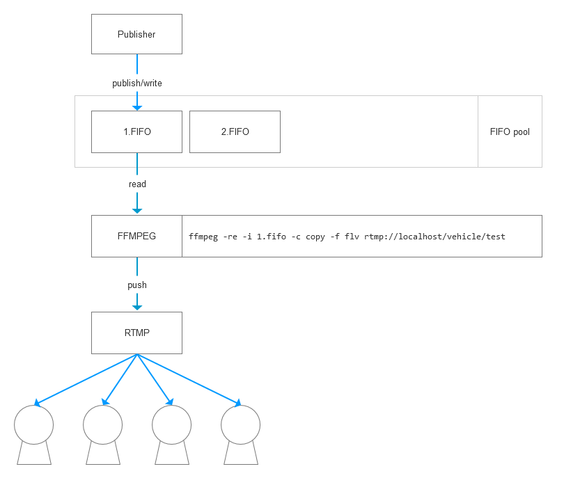

## jtt1078-video-server
基于JT/T 1078协议实现的视频转播服务器，当车机服务器端主动下发**音视频实时传输控制**消息（0x9102）后，车载终端连接到此服务器后，发送指定摄像头所采集的视频流，此服务器部分负责将视频流推送到RTMP服务器端，完成转播的流程。

### 准备工具
1. 安装了`ffmpeg`的linux一台（如果你是Windows 10，可以开启Windows子系统）
2. 安装了`nginx-rtmp-module`的`Nginx`服务器，用于实时视频的转播
3. `PotPlayer`，可用于播放实时转播的`RTMP`视频
4. 项目里准备了一个测试程序（`src/main/java/cn.org.hentai.jtt1078.test.VideoPushTest.java`），以及一个数据文件（`src/main/resources/tcpdump.bin`），数据文件是通过工具采集的一段几分钟时长的车载终端发送上来的原始消息包，测试程序可以持续不断的、慢慢的发送数据文件里的内容，用来模拟车载终端发送视频流的过程。

### 协议所定义的实时码流数据报文格式：

|起始字节|字段|数据类型|描述及要求|
|---|---|---|---|
|0|帧头标识|DWORD|固定为0x30 0x31 0x63 0x64|
|4|V|2 BITS|固定为2|
||P|1 BIT|固定为0|
||X|1 BIT|RTP头是否需要扩展位，固定为0|
||CC|4 BITS|固定为1|
|5|M|1 BIT|标志位，确定是否完整数据帧的边界|
||PT|7 BITS|负载类型，见表19|
|6|包序号|WORD|初始为0，每发送一个RTP数据包，序列号加1|
|8|SIM卡号|BCD[6]|终端设备SIM卡号|
|14|逻辑通道号|BYTE|按照JT/T 1076-2016中的表2|
|15|数据类型|4 BITS|0000：数据I祯等|
||分包处理标记|4 BITS|0000：原子包，不可拆分等|
|16|时间戳|BYTE[8]|标识此RTP数据包当前祯的相对时间，单位毫秒（ms）。当数据类型为0100时，则没有该字段|
|24|Last I Frame Interval|WORD|该祯与上一个关键祯之间的时间间隔，单位毫秒（ms），当数据类型为非视频祯时，则没有该字段|
|26|Last Frame Interval|WORD|该祯与上一个关键祯之间的时间时间，单位毫秒(ms)，当数据类型为非视频祯时，则没有该字段|
|28|数据体长度|WORD|后续数据体长度，不含此字段|
|30|数据体|BYTE[n]|音视频数据或透传数据，长度不超过950 byte|

经过阅读文档，以及测试，有如下问题或发现：
1. 视频流发送是不需要回应的，车载终端将一直持续不断的发送。
2. 1078协议借鉴了RTP协议，但不是真正的RTP协议。
3. 数据包的第30字节起为视频数据体，可以将每个消息包的这个部分保存到文件中，比如`xx.h264`，可以使用`PotPlayer`来播放。

一般来说，视频的推流首先想到的是使用`ffmpeg`，如果要集成`ffmpeg`的sdk，会有些麻烦，好像还得了解`ffmpeg`的API，有些麻烦。但是如果使用`ffmpeg`命令行来进行，它所需要的输入视频的参数可以是视频设备，或是视频文件，如果我们不断的生成文件，然后不断的创建`ffmpeg`进程，就Low爆了，所以这里我采用Linux所特有的`FIFO命名管道文件`来配合ffmpeg来进行转播，转播的大概流程框图如下：

`FIFO命名管道文件`跟java的`PipedStream`类似，如果一个命名管道文件没有`Writer`，那么对此文件的`read`将被阻塞，在这个项目里，通过创建子进程`ffmpeg`进行对文件的转播，而当文件还没有写入内容的时候，转播的过程将被阻塞，而当我们服务器端每收到一个实时视频流消息包时，都将视频数据体部分写入到此文件中，如此往复循环，能够很好的完成视频的推送。

### 测试步骤
1. 配置好服务器端，确定`mkfifo`命令是否存在，以及路径是否正确，可通过`which mkfifo`来确定路径。`ffmpeg`也一样。建立好`fifo-pool.path`的文件夹，用于存放转播中所使用到的命名管道文件。
2. 确保nginx服务器已经启动，同时配置文件里的`rtmp.format`已经设置为正确的RTMP地址格式。
3. 对项目进行打包，执行`mvn package`，进入到linux环境下，执行`java -jar jtt1078-video-server-1.0-SNAPSHOT.jar`来启动服务器端。
4. 在任意系统下，运行`VideoPushTest.java`，开始模拟车载终端的视频推送。
5. 服务器端的日志里将会输出`start streaming to rtmp://....`的字样，后面即为实际推送的RTMP地址。
6. 打开`PotPlayer`，按下`Ctrl+U`，输入上面输出的RTMP地址，稍等片刻就能看到转播出来的视频了。

> 好了，就到这里了，真的没有了。。。。

